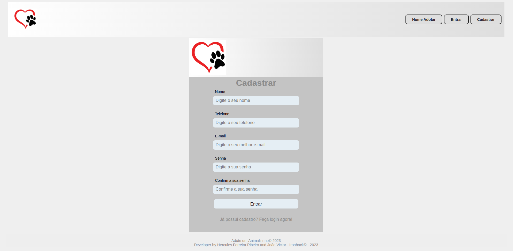
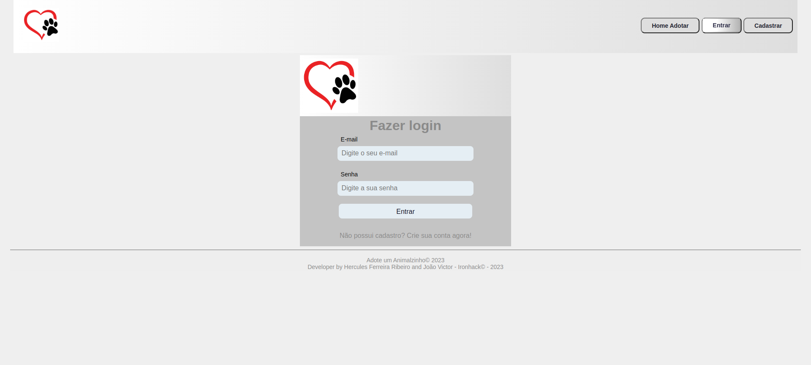
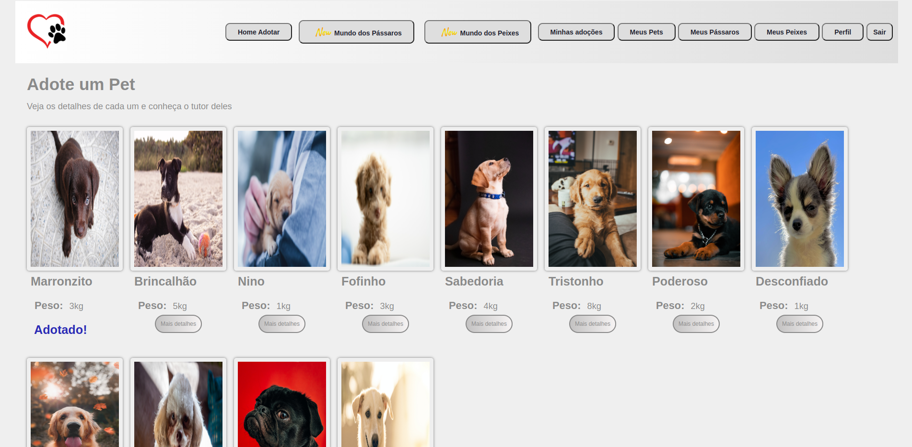
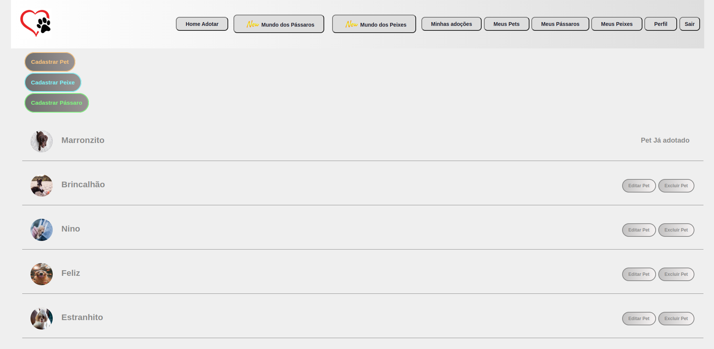
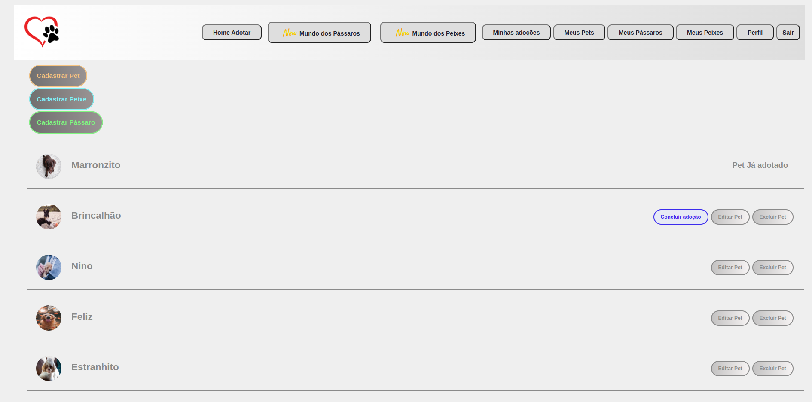
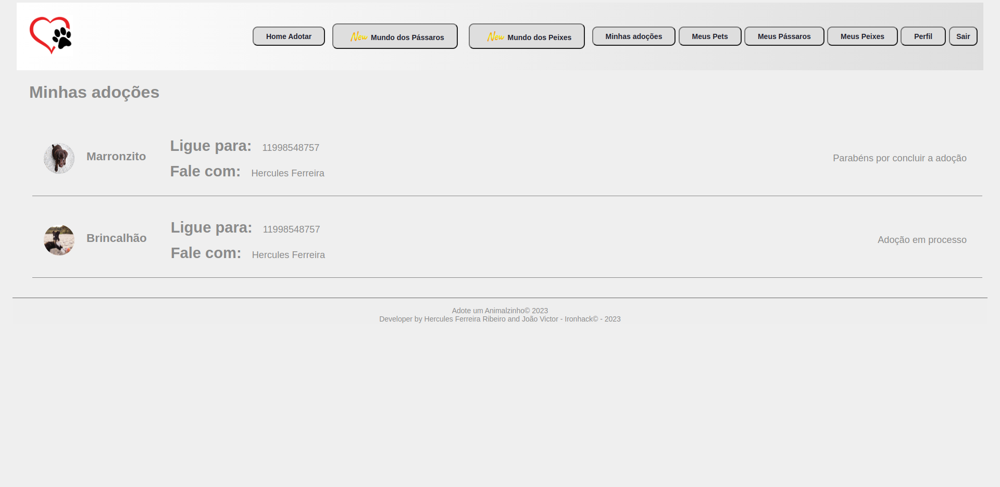
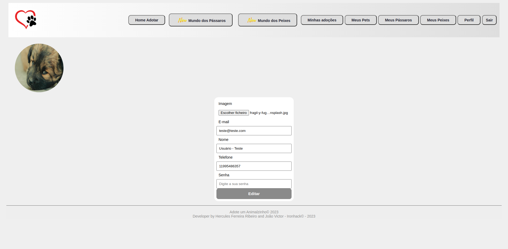

<h1>
Adote um Pet</h1>

<h1>
Índice</h1>

- [Sobre o site](#Sobre-o-Site)
- [Atualizações](#Atualizações)
- [Instalação](#Instalação)
- [Como Usar o Site](#Como-usar-o-Site)
- [Funcionalidades](#Funcionalidades)
- [Novas Versões](#Novas-Versões)
- [Issues](#Issues)
- [License](#License)
- [Contribuição](#Contribuição)

<h1>
Sobre o Site</h1>

📜 Para a confecção do site, as principais ferramentas utilizadas, foram: React, JS ES6.
 
📜 Combinando com os métodos: GET, POST, PUT e DELETE, para a conexão com API, e deploy, em: © 2023 Netlify, e © 2021-2023 Cyclic Software.
 
📜 Faça a diferença e contribua com a felicidade de muitos. Tanto de uma pessoa com a adoção, de um lindo Pet, ou contribua que seu filhotinho receba um novo lindo lar.
 
📜 Realize um cadastro caso e seja um novo integrante, e faça parte desse maravilhoso mundo dos Pets, ou se já possuir, cadastro, acesse a sua área privativa, através do seu login.
 
📜 Na sua área de membro tenha acesso as mais personalizadas áreas, para verificar Pets disponíveis para adoção, contribua com a adição curiosidades para o site, sobre a vida de Pássaros, e Peixes.
 
📜 Caso queira adotar um lindo Pet, faça a sua escolhendo  no nosso site, e poderá fazer um agendamento  para visitar o seu novo amigo. Com a visita, você conhecerá o doador e o seu pet, para assim acertar os detalhes da adoção.
 
📜 Após a adoção o doador deverá acessar a plataforma e confirmar a doação efetuada, e assim esse pet não ficará mais disponível para  adoção.
 
📜 Visite nossa página em: 
https://adote-new-pet.netlify.app

 

<h1>
🛠 Instalação</h1>

📌 [Como usar o Site](https://github.com/ai/size-limit#readme) - Nosso Site não precisa de recursos extras, apenas clique no link e já terá acesso a todas funcionalidades.

📌 [Funcionalidades](https://github.com/ai/size-limit#readme) - O usuário precisará apenas clicar no link de acesso, e fazer um cadastro para poder ver as opções do site.

<h1>
📈 Exemplos de uso do Site
</h1>

📌 [Tipos de acesso ao Site](https://github.com/ai/size-limit#readme) - Área de Cadastro.

  

   

  📌 [Tipos de acesso ao Site](https://github.com/ai/size-limit#readme) - Área de Login.

  

   

  📌 [Tipos de acesso ao Site](https://github.com/ai/size-limit#readme) - Área de Pets. Observe que acima. no cabeçalho, há uma área para navegação privativa, como perfil, meus pets etc

  

   

  📌 [Tipos de acesso ao Site](https://github.com/ai/size-limit#readme) - Área de Pets Privativa.
  

   

  📌 [Tipos de acesso ao Site](https://github.com/ai/size-limit#readme) - Área de Pets Privativa, com botão  de concluir uma adoção.
  

   

  📌 [Tipos de acesso ao Site](https://github.com/ai/size-limit#readme) - Área de Pets Privativa, Sobre suas adoções.
  

   

  📌 [Tipos de acesso ao Site](https://github.com/ai/size-limit#readme) - Sua área de perfiul, para editar seus dados ou colocar imagem.
  

   

<h1>
📋 Meta
</h1>

> :construction: Novas Versões do Site :construction:

📌 [Objetivos](https://github.com/ai/size-limit#readme) do Site será, colocar uma área com vários níveis de privilégios, de acordo com o ranking do usuário, e suas contribuições.

<h1>
📋 License
</h1>

To the extent possible by law, we disclaim all copyrights and rights related or connected with this work.

<h1>
🐛 Issues</h1>

Contate me através do github

<h1>
🚀 Contribuição
</h1>

1. Faça o _fork_ do projeto
2. Crie uma _branch_ para sua modificação (`git checkout -b meu-novo-recurso`)
3. Faça o _commit_ (`git commit -am 'Adicionando um novo recurso...'`)
4. _Push_ (`git push origin meu-novo-recurso`)
5. Crie um novo _Pull Request_

**Happy coding!** :heart:

  

[Back to top](#faqs)
